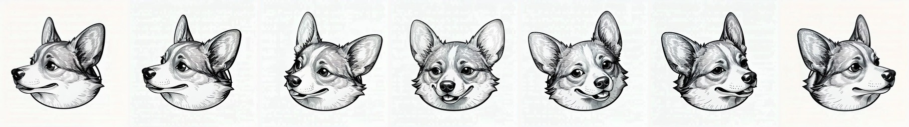
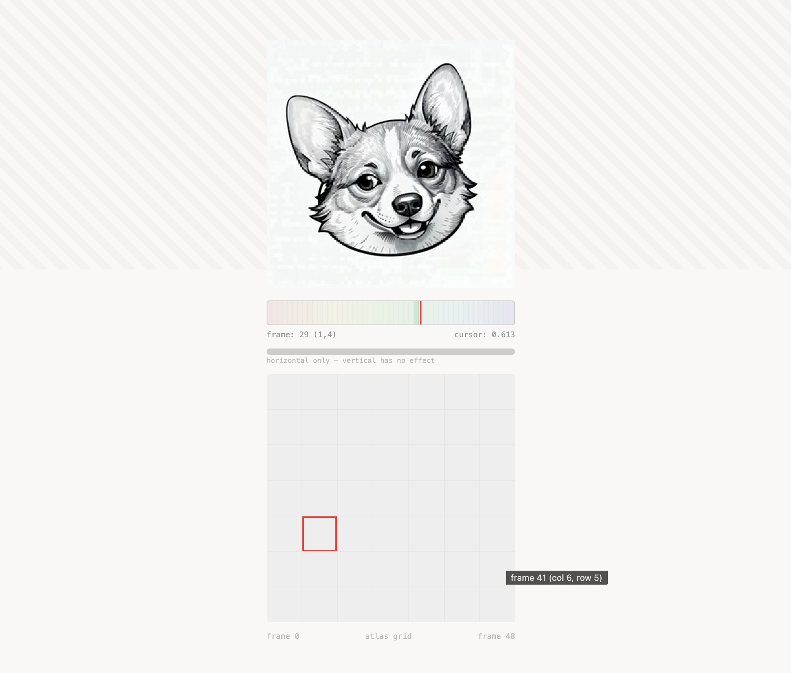

# gazeportrait

a sprite atlas portrait that follows your cursor. one image, one canvas, zero dependencies.





## try it

```bash
git clone https://github.com/agenticnotetaking/gazeportrait.git
cd gazeportrait
open example/index.html
```

an example atlas is included — it works immediately. the demo shows:

- the portrait tracking your cursor horizontally
- a frame bar mapping cursor position to the active frame
- a grid minimap highlighting the current atlas cell
- a hatched deadzone marking the upper hemisphere (no vertical tracking)

## walkthrough

### 1. generate or record a head-turn video

you need a short video (3–10 seconds) of a head turning left to right. options:

- **AI generation** — use [Kling](https://klingai.com/), Runway, Pika, or Stable Video Diffusion. prompt a smooth left-to-right head turn from a single portrait image.
- **real footage** — film someone (or a pet) turning their head. works the same way.

### 2. extract frames

```bash
./scripts/extract-frames.sh your-video.mp4
```

this extracts frames at 30 fps as PNGs into `frames/` using ffmpeg.

### 3. find the clean sweep

```bash
pip install -r scripts/requirements.txt
python scripts/build-contact-sheet.py frames/ --cols 15
```

open `contact-sheet.jpg`. you'll see a numbered grid of every frame. find the range where the head sweeps cleanly in one direction — note the start and end frame numbers.

### 4. build the atlas

```bash
python scripts/build-atlas.py frames/ \
  --start 120 --end 270 --count 49 --cols 7 \
  --size 256x256 --out example/atlas.jpg
```

- `--start` / `--end` — the frame range of your clean sweep
- `--count 49` — samples 49 frames evenly across the range (7x7 grid)
- `--reverse` — add this if the sweep goes right-to-left in the video

### 5. open the demo

```bash
open example/index.html
```

edit the config block at the top of `index.html` to match your atlas dimensions if they differ from the defaults.

### advanced pipeline (human faces only)

one command — uses MediaPipe face detection + OpenCV head-pose estimation to automatically sort frames by yaw, pick the sharpest per grid cell, and fill gaps.

```bash
pip install -r scripts/requirements-advanced.txt
python scripts/build-sprite-sheet.py your-video.mp4 --out example/atlas.jpg --grid 7
```

this doesn't work for pets or non-human subjects — use the manual pipeline above instead.

## how it works

a canvas draws one frame at a time from a sprite atlas (a single jpeg containing all frames in a grid). cursor X position maps to a frame index. smoothing prevents frame-snapping:

```
smooth += (mouse - smooth) * 0.35
drift = sin(elapsed / 3000) * 0.015
```

the `0.35` controls responsiveness — higher values track the cursor more tightly. the drift adds a subtle idle sway so the head never fully stops.

## config

both `example/index.html` and `react/GazePortrait.tsx` have a config block at the top:

| param | default | what it does |
|-------|---------|--------------|
| `COLS` | `7` | columns in the atlas grid |
| `ROWS` | `7` | rows in the atlas grid |
| `FRAME_W` | `256` | frame width in px |
| `FRAME_H` | `256` | frame height in px |
| `INVERT` | `false` | flip direction (if atlas sweeps R→L) |
| `ATLAS_SRC` | `atlas.jpg` | path to your sprite atlas |

### tuning the feel

| value | effect |
|-------|--------|
| `0.35` → `0.5` | snappier, more direct tracking |
| `0.35` → `0.2` | more inertia, floatier feel |
| `drift * 0.015` → `0.03` | more idle sway |
| `drift * 0.015` → `0` | completely still when idle |

## limitations

- **horizontal only** — cursor Y position has no effect. the atlas is traversed as a 1D sequence. the demo shows a hatched deadzone over the upper hemisphere to indicate this.
- **manual sweep selection** — for non-human subjects, you identify the clean sweep visually from the contact sheet. the advanced pipeline automates this for human faces.
- **frame order matters** — the simple pipeline packs frames in video order. if the sweep goes right-to-left, use `--reverse`.

## toward 2D tracking

the advanced pipeline already builds a 2D yaw x pitch grid — columns are yaw, rows are pitch. the viewer doesn't use the second axis yet.

full 2D tracking would map cursor X → column (yaw) and cursor Y → row (pitch):

```js
const col = Math.round(mouseX * (COLS - 1));
const row = Math.round(mouseY * (ROWS - 1));
```

this needs a source video with full head orbit (not just a horizontal pan) and a larger grid (12x12+) for smooth coverage.

## what's in here

```
example/
  atlas.jpg                    example atlas (works out of the box)
  index.html                   vanilla JS demo with debug overlay

react/
  GazePortrait.tsx             drop-in React component

scripts/
  extract-frames.sh            ffmpeg → PNGs
  build-contact-sheet.py       numbered review grid
  build-atlas.py               frame range → sprite atlas (with even sampling)
  build-sprite-sheet.py        video → atlas in one step (advanced, human only)
  requirements.txt             Pillow
  requirements-advanced.txt    opencv, mediapipe, numpy
```

## license

MIT
